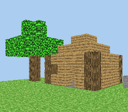

# MCTest

This originally came from this forum thread :
https://www.avrfreaks.net/forum/simple-3d-graphics-atmega-microcontroller

His code basically just outputs the 24-bits buffer to a BMP file.

This version was modified so it would work on a PC and fix some building errors.
The original program was designed to be run from an 8-bits CPU, the ATmega32.

Right now it supports SDL 1.2 and 8/16bpp.

# My plans

Crafti is unfortunately very memory intensive and on top of that, 
has C++ requirements that are very annoying.
This prevents the game from being ported to other platforms and 
given tht MCTest is fast and optimized for low end hardware,
this makes it very suitable for video game consoles with weak CPUs.

Ports i would like to do/feasible :
- Philips CDI (Using the OS9 newer GCC release)
- NEC PC-FX (liberis. i've already done nCraft for it but this will be better)
- Sega 32X/CD32X (RAM could be a limiting factor)
- Amiga CD32 (We want to target a stock unit even if slowRAM could be an issue with performance)

# TODO

- Add music and sound effects
- Add TNT block for explosions
- Allow starting positions to be changed per port/platform
- Cleanup source code
- Make sure the fixed point code can work without the fixed point draft from GCC
- Add camera controls to the game
- Eventually add collisions
- Being able to place a block in the world
- Giving the ability to save the world (should be quite easy to do)
